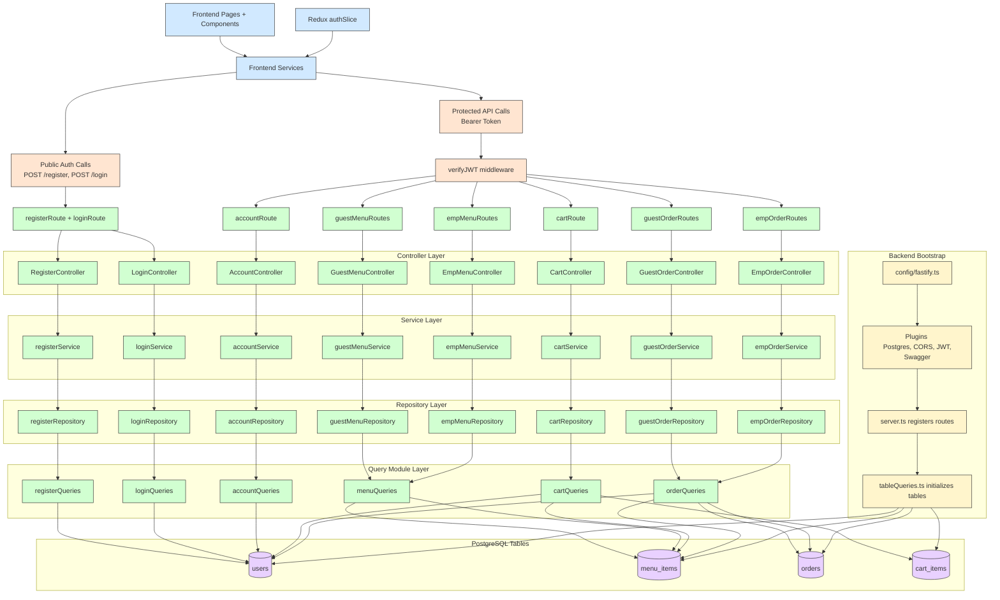

# Food Ordering Application Architecture

This is a cleaned, high-level architecture view of the current codebase. It keeps the real layering and major flows, but removes low-value visual noise.

## Notes

- Kept accurate architecture layers while reducing edge count for readability.
- Core backend pattern is route -> controller -> service -> repository -> query -> database.
- Protected groups use verifyJWT; register and login stay public.
- Startup schema currently initializes users, menu_items, orders, and cart_items.
- accountPopUp still fetches profile data through empService.fetchUserData, while account lookup logic now lives under accountRoute.